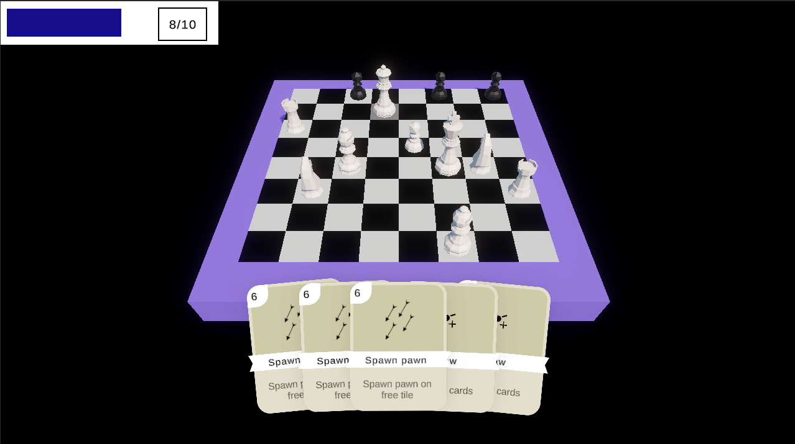
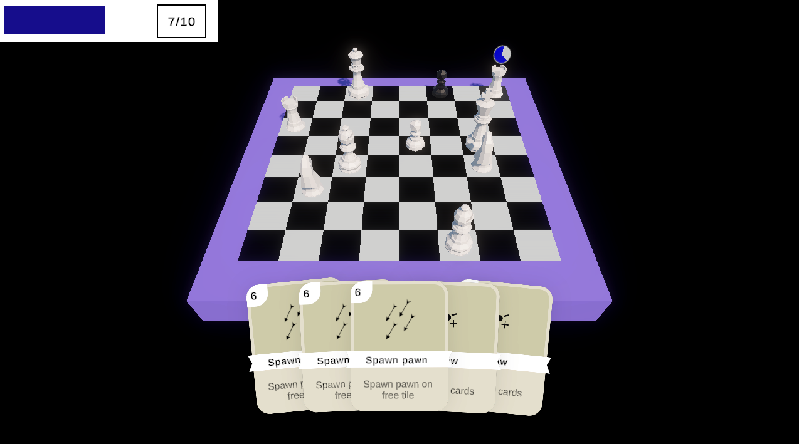
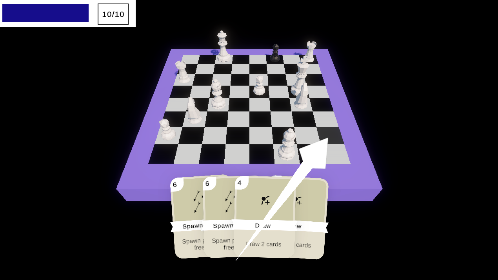

# Inżynierka

## Założenia  
Gra powstała jako projekt pracy inżynierskiej. Inspirowana sukcesem **Balatro**, łączy elementy klasycznych szachów z mechanikami karcianymi. Rozgrywkę można podzielić na dwa etapy.  

### Pierwszy etap  
Polega na walce z botem. Polem bitwy jest szachownica, a do dyspozycji gracza są **figury** i **karty**.  

#### Figury  
- Gracz nie musi czekać na ruch przeciwnika.  
- Ruchy figur są ograniczone **maną** — ruch można wykonać tylko, gdy gracz ma jej wystarczającą ilość.  
- Po wykonaniu ruchu figura musi odczekać, ale gracz może wykonywać ruchy innymi figurami w tym czasie.  

#### Karty  
- Zagranie karty kosztuje manę.  
- Karty wpływają na statystyki figur (np. koszt, czas odnowienia).  
- Mogą przywoływać dodatkowe figury.  
- Mogą mieć inne efekty specjalne.  

Gracz wygrywa, jeśli pokona przeciwnika — niekoniecznie króla, ale jego **dowódcę**.  

### Drugi etap  
Po bitwie gracz decyduje, dokąd się uda. Na mapie w stylu **Slay the Spire** może wybierać ścieżki, dobierać nowe karty i modyfikować położenie startowych figur.  

## Progres  
Projekt jest nadal rozwijany w **Unity Version Control**, dlatego aktualny postęp może nie być widoczny w repozytorium na GitHubie.  

## Screenshots  
  
  
  
